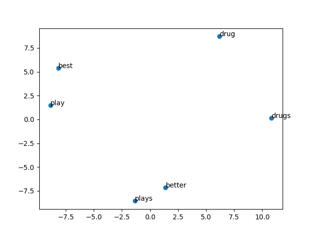

# SI231-Final-Project

## To run the code

```
pip install -r requirements.txt
```

```
python topic_modeling.py
```

## Result figures
### LSA


### BERT



## Further question please contact
chenzhuo@shanghaitech.edu.cn